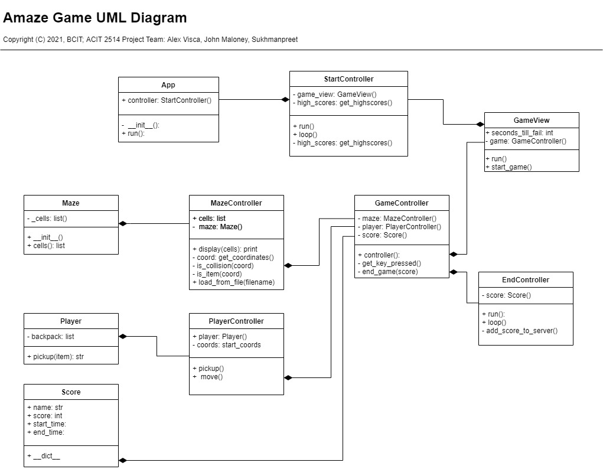

# Maze Game Development Project

## Project Scope
This application aims to create a simple game where a player must solve a maze. The game records a players score, and publishes these scores to a web browser.

## Development Team

Project produced for ACIT2515 Object-Oriented Programming in Python
Group Members|Job Description
------------|------------------------
Alex Visca | Development team leader
John Maloney| Developer, Documentation
Sukhmanpreet| Developer, QA and testing

---
## Getting Started

## **STEP 1**: Start the application server
Start by running `api.py` at `./Web/api.py`

## **STEP 2**: Start the game
Then run `main.py` at ./Maze/main.py

## **STEP 3**: Play the game
Game ruleset:
* The game will request a name. Optional (Defaults to "GUEST")  
* Controls with the arrow keys.  
* Crossing a loot item will automatically collect it and display the number of items in the backpack.  
* ***The player must collect all loot items before reaching the exit*** otherwise they lose.

## **STEP 4**: Repeat and compete
When the game ends, replay by running `./Maze/main.py` again.  
Scores are posted http://localhost:`<port>`/

---
## Gameplay and Features
**Start screen**:  
Requests the player's name. Optional (Defaults to 'GUEST')  
Shows previous players' high scores.  

Press ENTER to continue to the game screen

**Game screen**:  
Player controls:
*   Arrow keys to move
*   ESCAPE to exit  

Map  
*   Cannot pass through brick walls.  
*   All coins are placed randomly, and **must be picked up before using the exit**

Coins and backpack  
*   ***Player must collect all 4 coins before reaching the exit in order to win the game!***  
*   Number of coins collected in the player's backpack is shown in the top left corner of the screen.

Timer  
*   Player muct complete the maze before the timer runs out, otherwise they lose the game.
*   The time it takes for the player to complete the maze is measured to calculate a player score.

## Scores
High scores are accessible by a web browser at http://localhost:`<port>`/.  
Player scores are saved as `./Web/scores.json`

The score is the time it took a player to successfully complete the game. The less time, the better the score. For example a game that took 12 seconds to complete gets a score of 12, better than a game that took 15 seconds to complete.
Failed games are given a default score of 1000

# Application Design

---

## Application Package Contents
Maze Project/
*   Docs/
    *   MazeUML.pdf
    *   MazeUML.jpg
    *   project.md
    *   testplan.md
*   Maze/
    *   controllers/
        *   app.py
        *   end_controller.py
        *   game_controller.py
        *   maze_controller.py
        *   player_controller.py
        *   start_controller.py
    *   models/
        *   maze.py
        *   player.py
        *   score.py
    *   tests/
        *   test_controllers.py
        *   test_models.py
        *   test_views.py
    *   views/
        *   game_view.py
    *   main.py
*   Web/
    *   controllers/
        *   score_manager.py
    *   models/
        *   score.py
    *   templates/
        *   scores.html
    *   api.py
*   README.md

## Reasoning Behind Code Structure

### Screens
The start screen, game screen and end screen diplay very different content. For this reason the game was broken into these 3 stages. In retrospect, a screen controller would have been helpful in passing information such as username and score between screens.

### Game
The Maze and the Player are different entites that interact. For this reason we created a GameController to facillitate their interaction. We followed the MVC pattern, however creating views with pygame proved difficult as discussed in the Development Critique.

## Persistence

The Web API uses json for persistence. We chose JSON because the data was already stored in a dictionary which was very similar format. However we had to convert the score object to a dictionary to store it. We decided that every time a score is added we would rewrite the scores dict to a json. We did this for simplicity instead of having to figure out the change between the `scores.json` and the internally used scores dict. When the game is first run, we populate the internal scores dict with the saved json scores.

## Bonus Features

### Timer
The ingame timer begins when the game screen is first loaded. We used `pygame.time.get_tick()`. On each render, a function is called to see how much time has passed from when the game started. A property called `seconds_till_fail` that can be passed to the GameView and defaults to 30 seconds is the limit of how long a player has until their game ends and they autofail (with a score of 1000). We have an `end_game()` method that is called when this condition is reached. 

### Backpack
Internally we represent items we pick up just as numbers. 0 items in backpack means no items are picked up. We increment the number as items are walked over. To represent this to the player we take the item image and scale it down in the top left corner then represent the number of items in the backpack.

### Name
The player can optionally enter their name in the start screen. If they leave their name blank it defaults to 'GUEST'. We did this by creating an 'input box' which is just a pygame rect that captured any key inputs other than the ones to begin the game or exit. The name is saved as a string and backspace will delete the last character in the string. The name is then passed onto the gamecontoller then the endcontroller where it is sent to the web API. In retrospect a ScreenController would have allowed us to not have to pass the name property to different controllers.

### In-game Highscores
The start screen represents the top 3 highscores. The API is called to get the sorted list of highscores then the game trims it to only the top 3. We then represent them in order with names and score. If the API request fails, we decided to display an empty list instead of raisng an error. This way the game can still be played even if the API is not running.

### Game window scaling
The size of a tile is set at 50 pixels, however we use this to scale the size of the pygame window to the specific maze. For example the maze does not need to be a square, you can make it into any size rectangle you want and the window will scale to a size that represents the maze proportionally. We did this by reading in the maze text file, converting it to a matrix (list of lists) and then we could get the length and width of the maze.

## Development Critique

**Notes**: The architecture of the application *attempts* to apply the pygame library to the Model/View/Controller (MVC) design. This caused some issues in app design and structural flexibility was required to make the pygame library fit into MVC. If an impasse was reached, developers favoured pygame functionality over MVC. This is evident in the duplicated run() and loop() methods in several controllers and a high use of functional programming for fixes after the refactor.  
It was also a challenge to assign certain pygame specific render functions to views because they were necessary for conditions in the game loop, which was duplicated across controllers.

Future iterations may dispense with the PyGame library in favour of supporting libraries with a more MVC-friendly application design.
